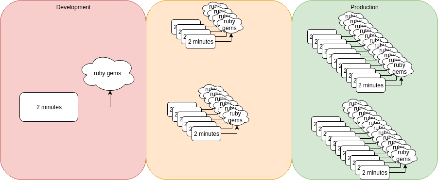
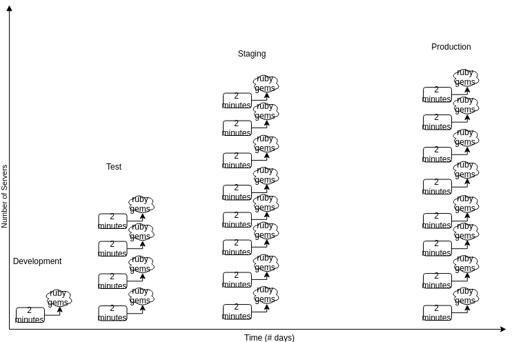

name: inverse
layout: true
class: center, middle, inverse
---
# Using Ansible<sup>*</sup> effectively for deployment

<sup>*</sup> Can be applied to other configuration management tools

.footnote[.pull-right[]]

???
Opportunity to talk and share

Something I picked up 5-6 years back, but want to share as I still don't see it being used and want to increase it's adoption.

---
layout:false
class: center, middle, inverse

## Who am I?
.right[
### Chao Luan
.pull-right[]

Lead DevOps Engineer @ Odecee

.fa[.fa-github[]] mistaka0s | .fa[.fa-linkedin-square[]] chao.luan
]

---
class: middle

.left-column[
Who am I?
]
.right-column[.middle[
- 16 years in IT, working in consultancies.

- Systems Admin background

- Middleware/Build Engineer ~ 2009

- Systems automation since 2010.

- Building platforms since then.

- Puppet in 2009/2010

- Ansible since 2012

]]


---
class: center, middle, inverse
# Agenda

---
class: middle

.left-column[
Agenda
]
.right-column[
1. Intro.

2. What Ansible (and others) good at

3. Idempotency

4. Packaging your application

5. Variable order and precedence

6. Dynamic Inventory

7. Roles

8. Host Groups

9. Misc/Q&A
]

---
class: center, middle, inverse
# Intro

---
class: middle

.left-column[
Intro
]

.right-column[
- Not about: how to use Ansible

- Techniques and principles
    + Can be applied to:
        + Puppet
        + Chef
        + Salt
        + et al

- Focus on Ansible
    + Best tool for the job at this moment.
    + Low barrier to entry (YAML based, not it's own DSL)
    + You get a lot out of the box.
    + Masterless, don't need a server, just somewhere with Ansible.
]

---
class: center, middle, inverse
# What Ansible (and others) are good at


---
class: middle
name: how
.left-column[
What Ansible (and others) are good at
]

.right-column[
All software configuration tools are good at three(3) things.

- Services

- Packages

- Files
]

--
.right-column[
Ansible has a fourth:
- Interacting with APIs/remote services (Ansible)
]

---
class: center, middle, inverse
# Walk before you run

---
class: middle
name: how
.left-column[
Walk before you run
]

.right-column[
- Take the time to plan

- Run through things manually, end to end
    + What happens when you run the commands/instructions again
        * Does it fail? How graceful is it? How destructive is it?

- Document the steps you want to automate
    + What do you need to support this?
]

---
class: middle
name: how
.left-column[
Walk before you run
]

.right-column[
- Focus on the outcome, not the steps.

   - 'I need to configure a virtual host' .green[.fa[.fa-check-circle[]]]
   - 'I need to edit an Apache/NGINX config file with this content' .red[.fa[.fa-minus-circle[]]]

- Start fresh each time
    + Note down dependencies
    + Changes made without writing it down - especially when you're trying to figure things out
]

---
class: middle
name: how
.left-column[
Walk before you run

(an example)
]

.right-column[
**Adding a user**

First time
```
# useradd splunk
# echo $?
0
```
SUCCESS!


Run it again...
```
# useradd splunk
useradd: user 'splunk' already exists
# echo $?
9
```
OH....
]
???
nice segue into idempotency

---
class: center, middle, inverse
# Idempotency

---
class: middle
name: how
.left-column[
Idempotency
]

.right-column[
*Idempotency*

```
In computer science, the term idempotent is used more
comprehensively to describe an operation that will
produce the same results if executed once or multiple times.
```
-- Wikipedia

]

---
class: middle
name: how
.left-column[
Idempotency
]
.right-column[
Should always be aiming for idempotency when writing your automation code

- Run your Ansible playbook multiple times, do you get the same behaviour?
    + Any changes made between runs?

- Most tasks within Ansible are idempotent
    + In the `useradd` example before
        + have to check where or not the user exists first
        + probably wrapped up in a script

    + Ansible's `user` task takes care of that for you.

- Try to avoid `command` and `shell`
    + you'd have to make sure it's idempotent yourself.

]

???
Not unique to Ansible, AWS has the same concept as well.

---
class: center, middle, inverse
# Packaging

---
class: middle
name: how
.left-column[
Packaging
]

.right-column[
Leverage the operating system's package management system to do **distribute** your application and do more of the heavy lifting.

- Helps with **idempotency**

- Not used often enough
    + simplifies a lot of things if you do

    + easy to distribute
        * compared to AMI/Docker container

Think of your code as a part in a car - your part may be used in many different models of cars, but it's always packaged up to be pluggable into a particular model.

Packaging your code ensures that it's directly `pluggable`, rather than spend lots of time trying to fit everything together.
]
---
class: middle
name: how
.left-column[
Packaging
]

.right-column[
- **Transactional**
    + Each RPM installed is a transaction in itself

- **Every file is tracked **in the YUM/RPM database
    + including checking changes made since the package was installed

    + meaning you can **verify** what's on a system is meant to be there.

- Packages can be **signed using GPG**
    + only packages signed with the GPG right key can be deployed.

- Treat packages as another artifact that you generate during your build process

- Build once, use many
]

---
class: middle
name: how
.left-column[
Packaging
]
.right-column[
- **Scripts** can be bundled with the RPM and can be run
    + pre un/installation
    + during
    + post un/installation

- **Dependencies** on other RPMs can be specified

    +  so you don't need to specify them when installing

- Can easily **determine the version** of the application is deployed
    + Just query yum/rpm for the version installed

    vs

    + Looking at a manifest somewhere
    + Looking at logs generated by puppet/ansible

```asciidoc
Ideally, the version can be queried at multiple levels
from the system level to being returned as part of a
REST/API call in human + machine parsable format
```

]

---
class: middle
name: how
.left-column[
Packaging
]
.right-column[
- **Compliance**
    + What code was deployed
    + When?
    + What's changed - Is what I am running still the same code I deployed?
    + Legal or regulatory requirements
]

---
class: middle
name: how
.left-column[
Packaging - Tools
]
.right-column[
Extend your existing build chain to generate an additional RPM artifact.

__Language specific__:
- `rpm-maven-plugin` (for Java/Maven)
- `gem2rpm` (Ruby)
- `rpm-builder` (NodeJS)

__Generic__:
- `rpmdevtools` - gives you `rpmbuild`, `spectool` etc
- `mock`/`docker-mock-rpmbuilder`
    + chroot`d environment to build your RPMs.
    + makes sure there's no missing dependencies for building the RPM ('BuildRequires')

__AVOID__:
- fpm
    - Good for one off packages
    - Very hard to get repeatable RPMs

```asciidoc
Invest in the time to generate RPM/packaged artifacts
works for you in the long run
```
]

---
class: center, middle, inverse
# Packaging Example

---
class: middle
name: how
.left-column[
Packaging Example
]
.right-column[
Ruby on Rails project from source.

Steps:
1. Check out project at `version`
2. Use `bundler` to download and compile dependencies from rubygems.org
3. edit config with environment specific settings (endpoints etc)
4. Use the local version of `rake` to precompile static assets (JS, CSS etc)
5. Change the ownership of files to `user1`, which will run the code

In code:
```asciidoc
git checkout -b <version> <project>
cd <project>
bundle check
bundle install --deployment --binstubs
<edit config>
bundle exec rake assets:clobber assets:precompile
chown -R <project> user1:user1
```

Total time: 2 minutes

]

---
class: middle
name: how

# Compile on deploy

If something goes wrong during the build, can the deployment be trusted?
- External dependencies
-


When your building on 20 servers and it fails on 2, how do you react


---
class: middle
name: how

# Dependency drift



???
You deploy to different environments at different times, what happens when a dependency is upgraded in the meantime?

What you tested, may not the same as what is deployed in production.
---
class: middle

We used to do this on each server/instance we deploy to:
```asciidoc
git checkout -b <version> <project>
cd <project>
bundle check
bundle install --deployment --binstubs
<edit config>
bundle exec rake assets:clobber assets:precompile
chown -R <project> user1:user1
```

With RPM packaging we now only need to do this:
```asciidoc
yum install <project>-<version>
<edit config> # or use etcd, confd, consul/consul-template
```

In ansible:
```ansible
yum:
    name: "{{ project }}-{{ version }}"
    state: present
```

---
class: center, middle, inverse
# Variable order and precedence

---
class: middle
name: how
.left-column[
Variable order and precedence
]
.right-column[
Ansible 2.x has order of precedence
```
- role defaults
- inventory file or script group vars
- inventory group_vars/all
- playbook group_vars/all
- inventory group_vars/*
- playbook group_vars/*
- inventory file or script host vars
- inventory host_vars/*
- playbook host_vars/*
- host facts
- play vars
- play vars_prompt
- play vars_files
- role vars (defined in role/vars/main.yml)
- block vars (only for tasks in block)
- task vars (only for the task)
- role (and include_role) params
- include params
- include_vars
- set_facts / registered vars
- extra vars (always win precedence)
```

More info: [Ansible docs - Variable Precedence](https://docs.ansible.com/ansible/latest/playbooks_variables.html#variable-precedence-where-should-i-put-a-variable)
]
---
class: middle
name: how
.left-column[
Variable order and precedence
]
.right-column[
Ansible 2.x has order of precedence for variables
```
*- role defaults
- inventory file or script group vars
- inventory group_vars/all
*- playbook group_vars/all
- inventory group_vars/*
*- playbook group_vars/*
- inventory file or script host vars
- inventory host_vars/*
- playbook host_vars/*
- host facts
- play vars
- play vars_prompt
- play vars_files
- role vars (defined in role/vars/main.yml)
- block vars (only for tasks in block)
- task vars (only for the task)
- role (and include_role) params
- include params
- include_vars
- set_facts / registered vars
*- extra vars (always win precedence)
```

More info: [Ansible docs - Variable Precedence](https://docs.ansible.com/ansible/latest/playbooks_variables.html#variable-precedence-where-should-i-put-a-variable)
]

---
class: middle
name: how
.left-column[
Variable order and precedence
]
.right-column[

```
├── group_vars
*│   ├── all # playbook group_vars/all
│   ├── dev
*│   ├── staging # playbook group_vars/*
│   ├── prod
├── playbooks
└── roles
    ├── common
*   │   ├── defaults #role defaults
    │   ├── files
    │   ├── handlers
    │   ├── tasks
    │   ├── templates
    │   └── vars
```

Extra vars:
```
ansible-playbook --extra-vars "key=value" ...
```
]

---
class: middle
name: how
.left-column[
Variable order and precedence
]
.right-column[
`inventory/dev/main.yaml`:
```ini
[dev]
server1
server2
```

`group_vars/dev`:
```yaml
---
demo: group_vars
```

`playbook.yaml`:
```yaml
---
- hosts: "{{ env }}"
  roles:
    - test
```

`roles/test/tasks/main.yaml`:
```yaml
---
- name: Print out the variable 'demo'
  debug:
    msg: "The value of 'demo' is {{ demo }}"
```
]

---
class: middle
name: how
.left-column[
Variable order and precedence
]
.right-column[
```
ansible -i inventory\dev -e env=dev playbook.yaml
```

```yaml
PLAY [dev] *********************************************************************

TASK [Gathering Facts] *********************************************************
ok: [localhost]

TASK [test : Print out the variable 'demo'] ************************************
ok: [localhost] => {
    "msg": "The value of 'demo' is group_vars"
}

PLAY RECAP *********************************************************************
localhost                  : ok=2    changed=0    unreachable=0    failed=0
```
]


---
class: center, middle, inverse
# Dynamic Inventory

---
class: middle
name: how
.left-column[
Dynamic Inventory
]
.right-column[
The trend towards public clouds and virtualized instances means that servers no longer exist for long periods of time.

Having these statically defined in your source code means you end up spending a lot of time managing inventory - could change many times a day.

```
Ansible can pull inventory information from dynamic sources
including cloud sources.
```

You can write your own inventory script - just needs to return valid JSON.
See [Developing Dynamic Inventory Sources](https://docs.ansible.com/ansible/latest/dev_guide/developing_inventory.html)
]

---
class: middle
name: how
.left-column[
Dynamic Inventory
]
.right-column[
The `EC2 dynamic inventory script` dynamic inventory script returns a list of EC2 instances within a region(s).

Not only returns a big list of EC2 instances but returns `host groups` based on the EC2 instance's tag, instance_id, region, vpc , sg etc.

Eg.
Instances tagged with 'webserver', will be returned as a host under `[tag_webserver]`

Use this to make your Ansible playbooks more generic (but dynamic at the same time)
```ini
# inventory host group
[webserver:children] #Specifying group of groups in Ansible
tag_webserver
```

```
# Playbook
- hosts: webserver
...
```
]

---
class: middle
name: how
.left-column[
Dynamic Inventory
]
.right-column[
Another way of adding hosts is during the playbook run.

```yaml
# Creates a new EC2 instance with a client token of 'id'
# Client token is 64 char ASCII string and is AWS' way
# of specifying an idempotent operation.
# If an ec2 instance with 'id' already exists, it will not create
# another one
- name: Create ec2 instance with clienttoken=id.
  local_action:
    module: ec2
    region: "{{ region }}"
    id: "{{ id }}"
    ...
    instance_tags: '{"id":"{{ id }}", "Name":"{{ id }}"}'
  register: ec2

- name: Add new instance(s) to host group
  add_host:
    hostname:"{{ item.public_dns_name }}"
    groups: "{{ id }}"
  with_items: ec2.instances

```

Each EC2 instance's public FQDN will be added to host group `id`. And be able to referenced in later plays.


]

---
class: center, middle, inverse
# Roles

---
class: middle
name: how
.left-column[
Roles
]
.right-column[

- Ansible comes with `ansible-galaxy` which helps you pull in roles from multiple locations, repositories

    + Ansible Galaxy - Online marketplace portal, similar to Puppet Forge

    + git,ssh+git - similar to Puppet's r10k

- Reuse your roles if possible

    + Single purpose

    + Don't be afraid to split them up

- Put them in separate repos so that it can be reused
]

---
class: middle
name: how
.left-column[
Roles
]
.right-column[
- Keep development best practices.
    + If your role is starting to get too long split it up
    + This applies to playbooks too

`tasks/main.yaml`
```
---
- include: prepare.yaml
- include: dependencies.yaml
- "include: {{ansible_os_family}}{{ansible_distribution_major_version}}.yaml"
```

`tasks/dependencies.yaml`
```
- yum:
    name: foo
    state: present
```

`tasks/RedHat7.yaml`
```
- yum:
    name: httpd
    state: present
```

]

---
class: middle
name: how
.left-column[
Roles
]
.right-column[
- Readability is key.

- Ansible docs has lots of examples that use key=value - Don't do this

eg.
```yaml
  tasks:
  - name: ensure postgresql is at the latest version
    yum: name=postgresql state=latest
  - name: ensure that postgresql is started
    service: name=postgresql state=started
```

Instead this should be more key:value and more YAML-like dictionary structures.

```yaml
- name: ensure that postgresql is started
  yum:
    name: postgresql
    state: latest
```

Having your key:values structured in a more YAML-like
format ensures readability, but also means it's easy to
see changes made through `diffs`
]

---
class: center, middle, inverse
# Host Groups

---
class: middle
name: how
.left-column[
Host Groups
]
.right-column[
Design your Ansible playbooks and hosts groups by __function__ rather than by __server__.

It's ok to duplicate hosts and have them in many different groups, it's also good to nest groups.

How I usually nest my host groups.

`environment` <- `location` <- `function`
`function` <- `location`

```ini
[dev:children]
usa
aus

[aus:children]
aus-webserver
aus-database

[webserver:children]
aus-webserver
usa-webserver

[aus-webserver]
webserver1
webserver2
...
```
]

---
class: center, middle, inverse
# Host Groups

---
class: middle
name: how
.left-column[
Host Groups
]
.right-column[
What's the benefit of doing this?

```yaml
- hosts: dev
  tasks:
    # Note: don't blindly update all packages unless you
    # manage your own repos
    - name: ensure all packages are up to date
      yum:
        name: *
        state: present

- hosts: webserver
  roles:
    - apache
    - postgresql-client

- hosts: database
  ....
```

"Connects"<sup>*</sup> to the same host twice, once for the dev host, once for the webserver host.

By passing the `--limit webserver` we can restrict the hosts that playbook affects to only hosts in the `webserver` group


<sup>*</sup>With some tweaking of SSH connection settings, the connection remains active throughout different plays.
]

---
class: middle
name: how
.left-column[
Host Groups
]
.right-column[
- Ansible has a location called `group_vars` that you can place variables for `host groups`.

- For a host in the `webserver` host group

  - variables are loaded from both `group_vars/dev` and `group_vars/webserver`

  - available to be used throughout the playbook.

`dev` should hold environment specific variables - endpoints, loglevels etc.

`webserver` should hold function specfic variables that you want to override from defaults - ports, locations etc.
]


---
class: center, middle, inverse
# Miscellaneous

---
class: middle
name: how
.left-column[
Miscellaneous
]
.right-column[
To make your automation easier, it's important to have the proper supporting services.

Things like:
 - `LDAP` to manage your users and groups

 - `DNS` to manage endpoints

 - Package repository to manage your packages

`Ansible` (or any other tool) isn't meant to be used to ensure users exists on all your servers.
]

---
class: middle
name: how
.left-column[
Miscellaneous
]
.right-column[
## Package repository to manage your packages
- Off the shelf
  + `Sonar Nexus` and `Artifactory` has plugins which enumulate a yum or apt repository.

  + Packages are stored in the same place as your code artifacts.

- Build your own
  + RedHat has a tool called PULP which helps you manage packages between repos.

  + `createrepo` generates all the yum repository metadata for RPMs in the current directory, just serve it in a webserver.
]

---
class: middle
name: how
.left-column[
Miscellaneous
]
.right-column[
## Package repository to manage your packages
- Package repository layout

  + Bare minimum you should have two repos

    * `development` and `stable`

  + treat `development` as unstable builds

  + as soon as a package has passed specific tests or entered in a particular environment - promote it to `stable`

  + Helps with artifact management

    * `development` can be deleted

    * `stable` can be archived
]


---
class: center, middle, inverse
# Thank you!
## Questions?